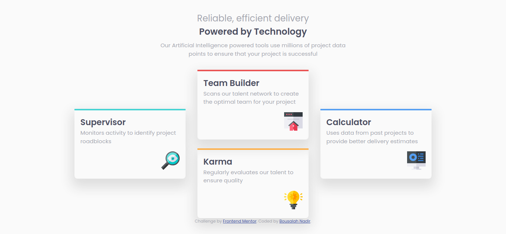
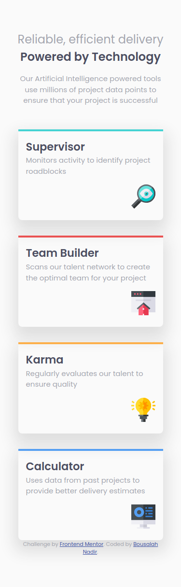

# Frontend Mentor - Four card feature section solution

This is a solution to the [Four card feature section challenge on Frontend Mentor](https://www.frontendmentor.io/challenges/four-card-feature-section-weK1eFYK). Frontend Mentor challenges help you improve your coding skills by building realistic projects. 

## Table of contents

- [Overview](#overview)
  - [The challenge](#the-challenge)
  - [Screenshot](#screenshot)
  - [Links](#links)
- [My process](#my-process)
  - [Built with](#built-with)
- [Author](#author)

## Overview

### The challenge

Users should be able to:

- View the optimal layout for the section depending on their device's screen size

### Screenshot

  ## Desktop 
  

  ## Mobile 
  

### Links

- Solution URL: [solution](https://github.com/Medido1/Frontend-Mentor-Four-card-feature-section)
- Live Site URL: [live site](https://medido1.github.io/Frontend-Mentor-Four-card-feature-section/)

## My process

### Built with

- Semantic HTML5 markup
- CSS custom properties
- Flexbox
- Mobile-first workflow

## Author

- Frontend Mentor - [@Medido1](https://www.frontendmentor.io/profile/Medido1)
- GitHub - [@Medido1](https://github.com/Medido1)

